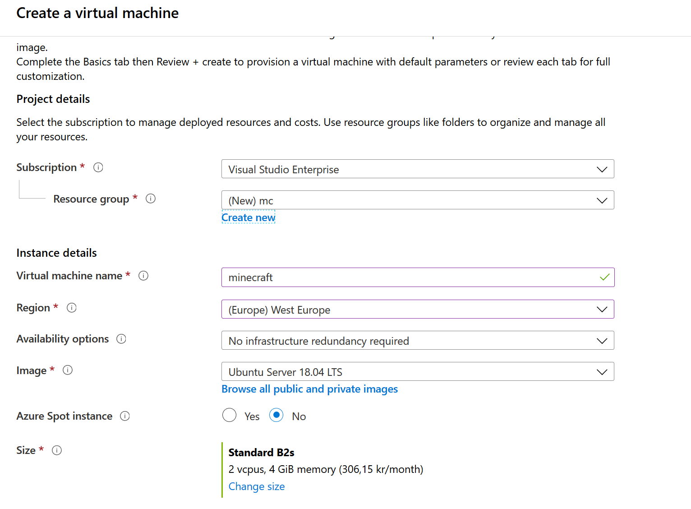

# Introduction
This page contains very brief instructions for setting up a minecraft server on a virtual machine in Azure. 

To be able to follow along, you need an Azure subscription. If you don't have one, you can sign up for free here: https://azure.microsoft.com/en-us/free/

The instructions are based on what can be found here: 
https://minecraft.gamepedia.com/Tutorials/Setting_up_a_server


## Start Ubuntu 18.04 server on Azure
First make sure you are logged in to the Azure portal, on https://portal.azure.com

Once logged in, search for "Ubuntu 18.04 server" from the search bar on the left hand side of the portal (this might change over time). Among the search results you should find the Ubuntu 18.04 server from **Canonical**, make sure to use this one.

<p align="left">
  
</p>

Click on the **Create** button to start the process of creating the virtual machine.

In the next screen, fill out the details in a similar way as in the picture below. 

For the "Resource Group" choose **create new** and give is a nice name. I called it "mc". 

For "size" I selected B2s, which is a rather inexpensive VM size with 2 vCPUs and 4 Gig RAM, that will probably stand up for 10 simultaneous users (just guessing). 

<p align="left">
  
</p>


Further down the same page, you need to add a username/password (or ssh key, which is much more convenient if you know how to do it. I will not go into that now though). Make sure you remember the password you choose!

Also, you need to allow ````ssh```` in the inbound port section. 

This is how it should look, sort of:

<p align="left">
  
</p>

At this point you could either go ahead and click "Review + Create" or you can click on "next" to customize your VM further. If you click next, I suggest the following settings:

* Disks: Choose Standard SSD
* Networking: Keep defaults
* Management: Enable Auto-Shutdown (I will automatically shut down the server at midnight, for example)
* Advanced: Keep defaults
* Tags: A good thing to use, but lets leave that for a later time

Then go ahead and create the server. It will take a couple of minutes, after which you will be able to ssh into the VM and start installing and setting up minecraft.

## Access the VM
For this step I will assume that you know how to use ssh. If not, find a basic ssh tutorial somewhere, its a very easy tool to use, once you know a few basics.

In the Auzre portal, you can find the address to connect to. This info is located where the rest of the info about your VM is. Look for DNS Name. It should be something similar to DNS name my_mc_server.westeurope.cloudapp.azure.com

To access your machine with SSH, type in this (change your_user_name to your actual user name :-) and change my_mc_server to the actual name of your server) 

````
ssh your_user_name@my_mc_server.westeurope.cloudapp.azure.com
````

You will be prompted for your password, which you remember, right?

## Create minecraft user
Once logged in, you can start by creating a new user. 

````
$ sudo useradd -m -r -d /opt/minecraft minecraft
````

## Install minecraft Server
The commands below will create a directory to hold your server. For simplicity, lets call it "server". It should be located under /opt/minecraft, to keep things tidy.

Then we use wget to download the minecraft server. The command downloads version 1.12.2, but you can check with the official minecraft page if there is a newer one available.


````
$ sudo mkdir /opt/minecraft/server
$ sudo wget -O /opt/minecraft/server/minecraft_server.jar https://s3.amazonaws.com/Minecraft.Download/versions/1.12.2/minecraft_server.1.12.2.jar
````

Then we change the ownership of the newly created folder, to our newly create minecraft user, and make sure that EULA is set to true (this is needed for the server to start. Its kind of like the "do you approve the terms and conditions"-checkbox which everyone clicks without reading the terms and conditions...)

````
$ sudo chown -R minecraft /opt/minecraft/server/
$ sudo bash -c "echo eula=true > /opt/minecraft/server/eula.txt"
````


## Autostart
We want the minecraft server to start automatically when the virtual machine is started. This will enable us to save money by shutting down the server when it is not needed, and to recover if the VM should crash or break in some way. 

Create a file named /etc/systemd/system/minecraft@.service file with the following content:

````
[Unit]
Description=Minecraft Server: %i
After=network.target

[Service]
WorkingDirectory=/opt/minecraft/%i

User=minecraft
Group=minecraft

Restart=always

ExecStart=/usr/bin/screen -DmS mc-%i /usr/bin/java -Xmx3G -jar minecraft_server.jar nogui

ExecStop=/usr/bin/screen -p 0 -S mc-%i -X eval 'stuff "say server shutting down."\015'
ExecStop=/bin/sleep 5
ExecStop=/usr/bin/screen -p 0 -S mc-%i -X eval 'stuff "save-all"\015'
ExecStop=/usr/bin/screen -p 0 -S mc-%i -X eval 'stuff "stop"\015'


[Install]
WantedBy=multi-user.target


Now, we can try to start the minecraft Server
````
$ sudo systemctl start minecraft@server
````

Confirm status:
````
$ sudo systemctl status minecraft@server
````


Make sure  the server starts after reboot:
````
$ sudo systemctl enable minecraft@server
````    