# Introduction
This page contains some brief instructions for setting up a minecraft server on a virtual machine in Azure. 

To be able to follow along, you need an Azure subscription. If you don't have one, you can sign up for free here: https://azure.microsoft.com/en-us/free/

The instructions are based on what can be found here: 
https://minecraft.gamepedia.com/Tutorials/Setting_up_a_server


## Start Ubuntu 18.04 server on Azure
First make sure you are logged in to the Azure portal, on https://portal.azure.com

Once logged in, search for "Ubuntu 18.04 server" from the search bar on the left hand side of the portal (this might change over time). Among the search results you should find the Ubuntu 18.04 server from **Canonical**, make sure to use this one.

<p align="left">
  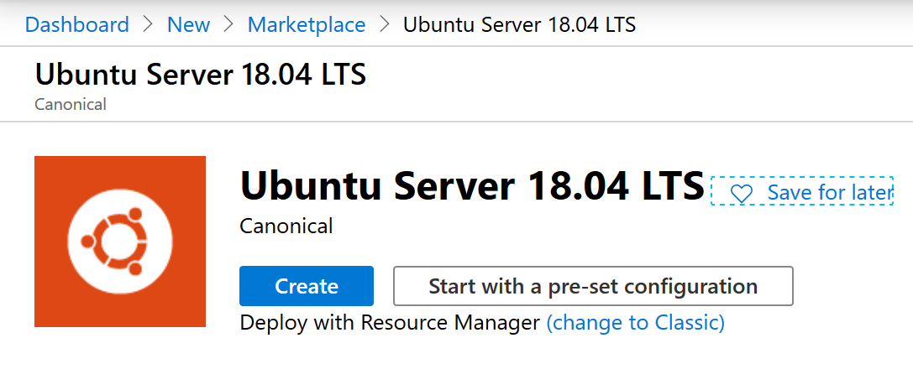
</p>

Click on the **Create** button to start the process of creating the virtual machine.

In the next screen, fill out the details in a similar way as in the picture below. 

For the "Resource Group" choose **create new** and give is a nice name. I called it "minecraft". 

For "size" I selected B2s, which is a rather inexpensive VM size with 2 vCPUs and 4 Gig RAM, that will probably stand up for 10 simultaneous users (just guessing). 

<p align="left">
  
</p>


Further down the same page, you need to add a username/password (or ssh key, which is much more convenient if you know how to do it. I will not go into that now though). Make sure you remember the password you choose!

Also, you need to allow ````ssh```` in the inbound port section. 

This is how it should look, sort of:

<p align="left">
  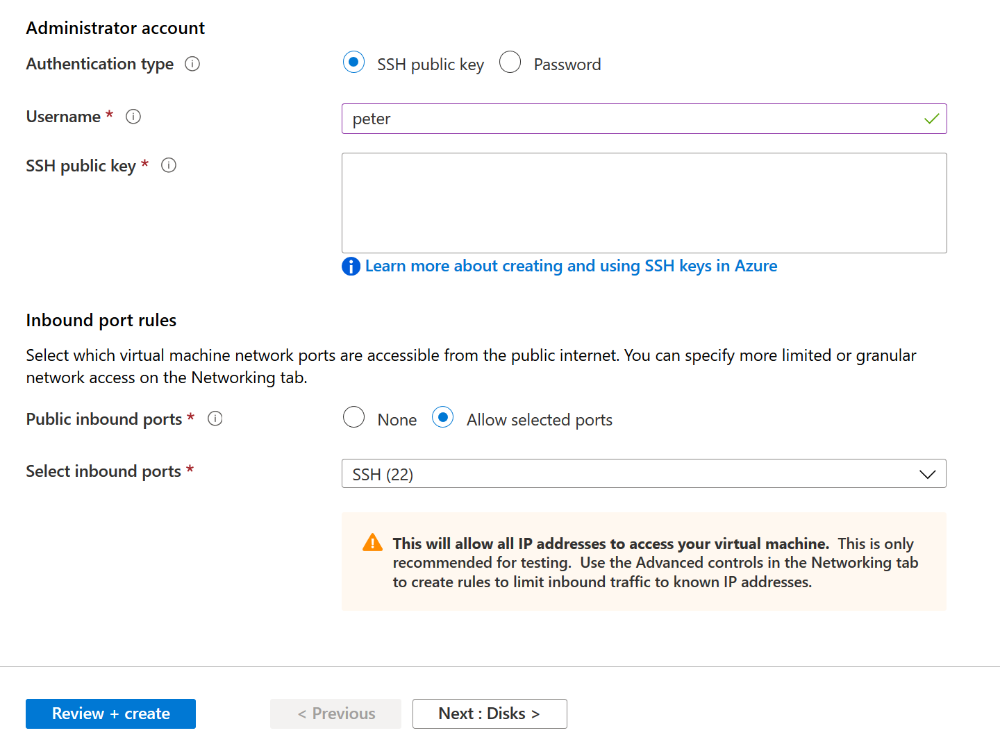
</p>

At this point you could either go ahead and click "Review + Create" or you can click on "next" to customize your VM further. If you click next, I suggest the following settings:

* Disks: Choose Standard SSD
* Networking: Keep defaults
* Management: Enable Auto-Shutdown (I will automatically shut down the server at midnight, for example)
* Advanced: Keep defaults
* Tags: A good thing to use, but lets leave that for a later time

Then go ahead and create the server. It will take a couple of minutes, after which you will be able to ssh into the VM and start installing and setting up minecraft.

When the VM has been created, you can use the button "Go to resource" to go to page for your new VM.

<p align="left">
  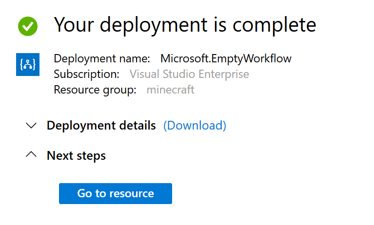
</p>

## Access the VM
For this step I will assume that you know how to use ssh. If not, find a basic ssh tutorial somewhere, its a very easy tool to use, once you know a few basics.

In the Auzre portal, you can find the address to connect to. This info is located in the Overview page for your Virtual Machine. Look for "DNS Name". It should be something similar to DNS name my_mc_server.westeurope.cloudapp.azure.com

To access your machine with SSH, type in this (change your_user_name to your actual user name :-) and change *my_mc_server* to the actual name of your server) 

````
ssh your_user_name@my_mc_server.westeurope.cloudapp.azure.com
````

You will be prompted for your password, which you remember, right?

## Create minecraft user
Once logged in, you can start by creating a new user. 

````
$ sudo useradd -m -r -d /opt/minecraft minecraft
````

## Install minecraft Server
The commands below will create a directory to hold your server. For simplicity, lets call it "server". It should be located under /opt/minecraft, to keep things tidy.

Then we use wget to download the minecraft server. The command downloads version 1.12.2, but you can check with the official minecraft page if there is a newer one available.


````
$ sudo mkdir /opt/minecraft/server
$ sudo wget -O /opt/minecraft/server/minecraft_server.jar https://s3.amazonaws.com/Minecraft.Download/versions/1.12.2/minecraft_server.1.12.2.jar
````

Then we change the ownership of the newly created folder, to our newly create minecraft user, and make sure that EULA is set to true (this is needed for the server to start. Its kind of like the "do you approve the terms and conditions"-checkbox which everyone clicks without reading the terms and conditions...)

````
$ sudo chown -R minecraft /opt/minecraft/server/
$ sudo bash -c "echo eula=true > /opt/minecraft/server/eula.txt"
````


## Autostart
We want the minecraft server to start automatically when the virtual machine is started. This will enable us to save money by shutting down the server when it is not needed, and to recover if the VM should crash or break in some way. 

Create a file named /etc/systemd/system/minecraft@.service file with the following content:

````
[Unit]
Description=Minecraft Server: %i
After=network.target

[Service]
WorkingDirectory=/opt/minecraft/%i

User=minecraft
Group=minecraft

Restart=always

ExecStart=/usr/bin/screen -DmS mc-%i /usr/bin/java -Xmx3G -jar minecraft_server.jar nogui

ExecStop=/usr/bin/screen -p 0 -S mc-%i -X eval 'stuff "say server shutting down."\015'
ExecStop=/bin/sleep 5
ExecStop=/usr/bin/screen -p 0 -S mc-%i -X eval 'stuff "save-all"\015'
ExecStop=/usr/bin/screen -p 0 -S mc-%i -X eval 'stuff "stop"\015'


[Install]
WantedBy=multi-user.target
````

Worth noticing is this line ````ExecStart=/usr/bin/screen -DmS mc-%i /usr/bin/java -Xmx3G -jar minecraft_server.jar nogui```` which tells the server to use 3 Gig of memory as a max. I set it to this because the VM we used has 4 Gig RAM available, and I didn't want to push it further (though that is probably possible if needed). 

Finally, to make CPU requirements lower, its a good idea to lower the view-distance to perhaps 7 (from default which is 10). To do that, you can run this command:

````
sudo sed -ir 's/view-distance=10/view-distance=7/g' /opt/minecraft/server/server.properties
````

This will simply replace a text in your server.properties file, from "view-distance=10" to "view-distance=7"


Now, we can try to start the minecraft Server
````
$ sudo systemctl start minecraft@server
````

Confirm status:
````
$ sudo systemctl status minecraft@server
````


Make sure  the server starts after reboot:
````
$ sudo systemctl enable minecraft@server
````    

## Start VM automatically

In order to save money, I activated automatic shutdown of the VM at midnight. To start it up again, you can simply start the VM from the Azure portal. However, if you want this to happen at the same time everyday, you might as well automate a little bit. 

One way of doing this is to use a **Logic app**. A Logic app is a "No code" way of creating a small function that performs a specific task. In our case, we will create a logic app that starts the VM every day at 09:00.

Go to the portal and search for "logic apps" and select "Logic Apps" from the list of search results

<p align="left">
  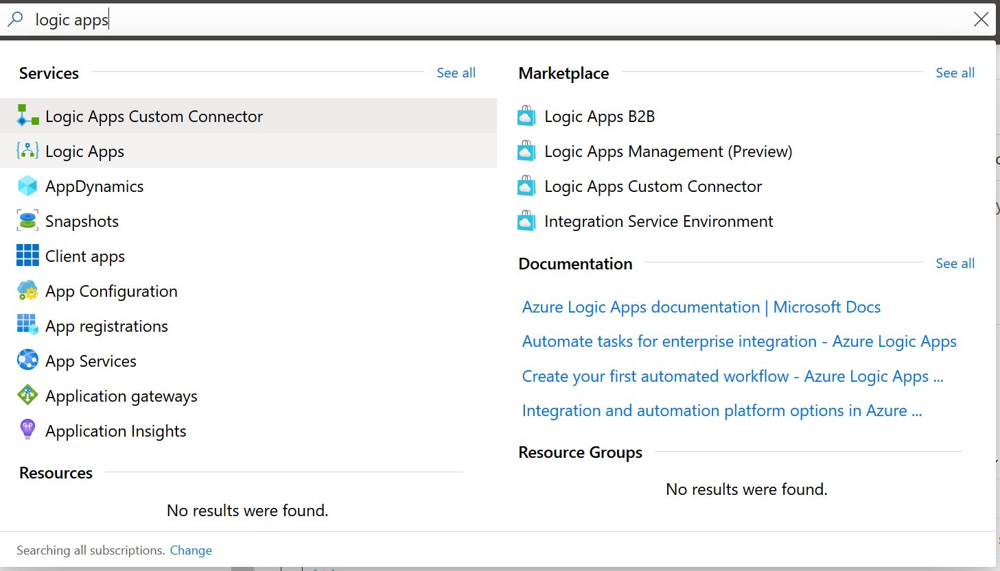
</p>

You will end up with a page that looks similar to this:

<p align="left">
  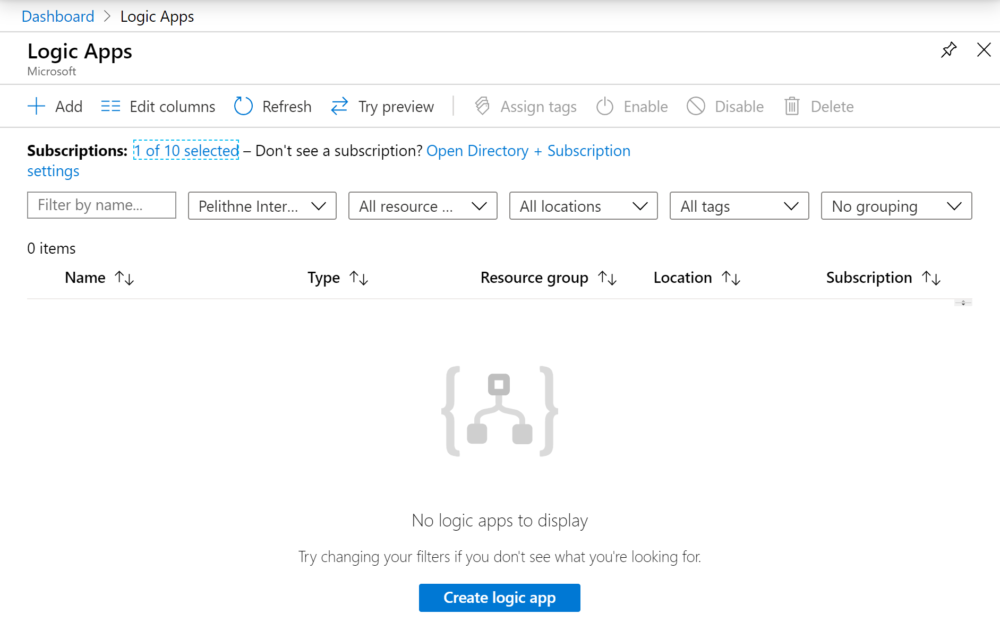
</p>

Click the button "Create Logic App" at the bottom of the page. You will be asked to fill in the details for your logic app. It should look similar to this (just make sure that you use the resource group created earlier, and place it in the same region as your virtual machine, e.g. West Europe)

<p align="left">
  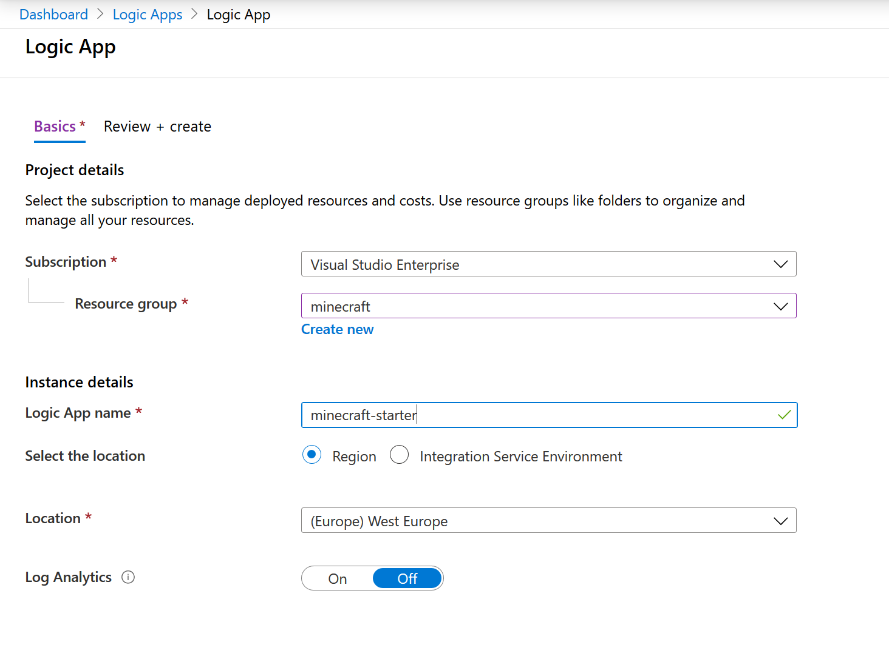
</p>

When the logic app has been created, you can use the button "Go to resource" to get to your new app.

<p align="left">
  
</p>

You should see a page that looks similar to the picture below. We will be using a time based trigger for our function, so you will use the trigger called **Recurrence**

<p align="left">
  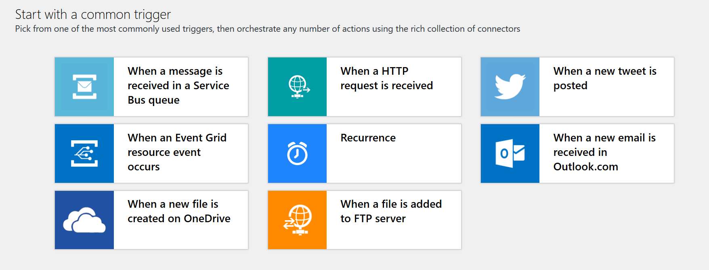
</p>

Use the "Add new parameter" button to add "Time zone" and hours and minutes, like this:

<p align="left">
  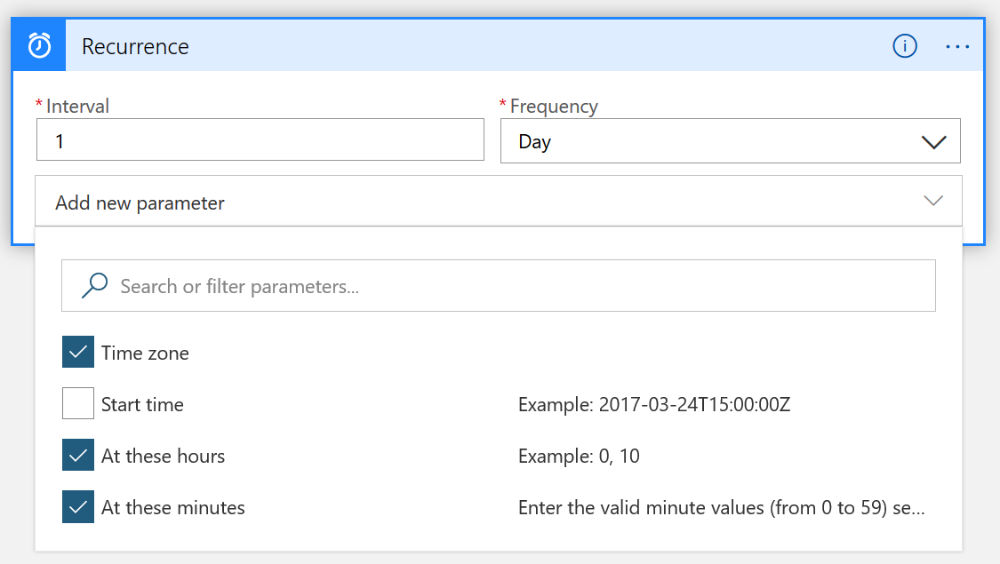
</p>

Then set the values to whatever works for you, similar to this:

<p align="left">
  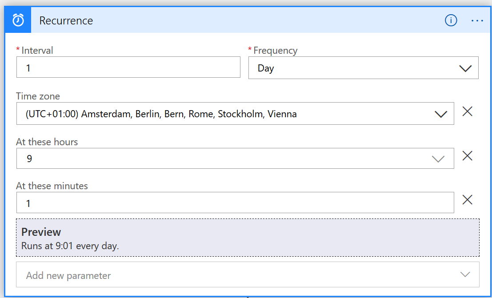
</p>

When you are done, you have created the trigger that controls when your app runs. Click the save button to make sure that the function app is created.

Now you need to make it do something as well... We want it to do an HTTP call to the Azure API, to start the Minecraft Virtual machine. 

For this to actually *work*, we need to do some additional work with permissions, more precisely **Managed Identity**. In short, we need to allow the logic app to start the virtual machine. 

First, we need to give the logic app an identity. This is done in the identity section of your logic app. Click *Identity* under *settings* in the left hand pane:

<p align="left">
  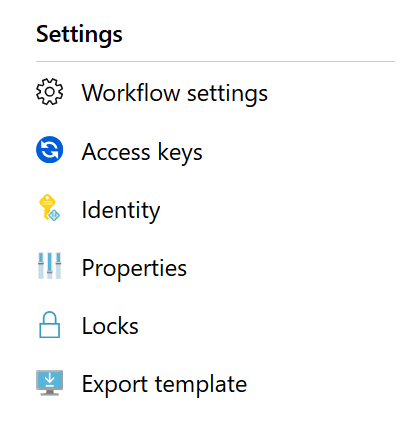
</p>

In the following page, make sure that the **System Assigned** managed identity is set to **on**, and then click *save*. 

<p align="left">
  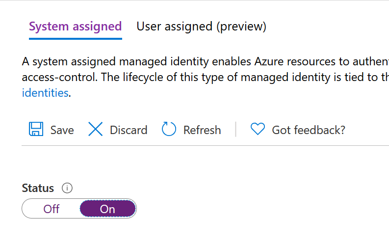
</p>


Now we need to allow this identity to restart our Virtual Machine. This is done from the settings page of the virtual machine, in the "Access Control (IAM)" 

<p align="left">
  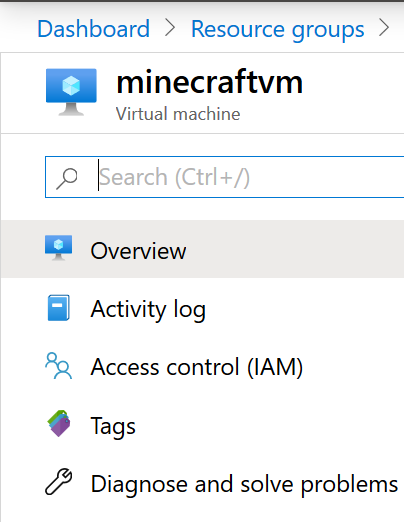
</p>

Click the "+ Add" and choose "Add role assignment"

<p align="left">
  
</p>

Fill out the settings. Use the role "Virtual Machine Contributor", then assign access to "Logic App" and select the logic app you created previously.

<p align="left">
  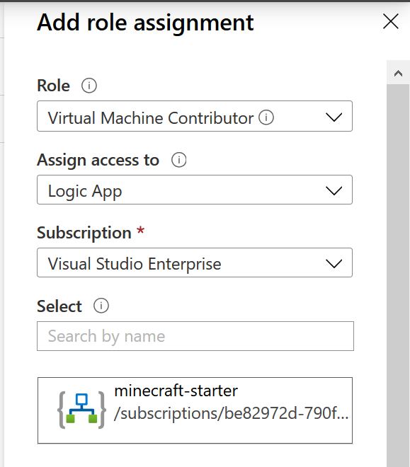
</p>

Click **Save**.

Before moving on to the next step, we need to find the GUID of the subscription we are using. You can do that by using the search bar as search for **subscriptions** and select subscriptions from the search results. Next to the name of your subscription, there will be a long alphanumeric string, called the Subscription ID. Copy that string, you will need it later. 


To start a VM using the Azure API, we can add a new step to the logic app. Go to your logic app, and navigate to **Logic app designer** under development tools in the left hand navigation pane. 

Click on "New step" and and use the HTTP. Then choose "POST" as method, and paste in the following into the **URI** field

````
https://management.azure.com/subscriptions/<your subscription id>/resourceGroups/<your resource group>/providers/Microsoft.Compute/virtualMachines/<your virtual machine name>/start?api-version=2019-03-01
````
Replace "\<your subscription id\>" with the ID that you found in the previous step.

Replace "\<your resource group\>" with the name of the resource group you created earlier (in my case, "minecraft").

Replace "\<your virtual machine name\>" with the name of your VM (in my case minecraftvm)

Then select "Add new parameter" and select "Authentication". Choose Authentication type "Managed Identity" and "System Assigned Managed Identity" (this is the identity you created earlier). 

You should end up with something that looks similar to this (but with values replaced as suggested above):

<p align="left">
  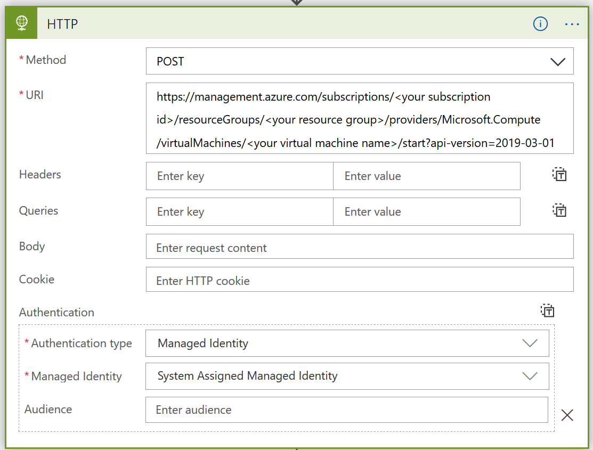
</p>

Click Save, and that's it. Your logic app should now run once per day and start your virtual machine. 

You can try it out by stopping your VM from the Virtual machine settings page, and then select "Run Trigger" from your functions app page. If all goes well, your machine should start and your minecraft server should be automatically started when the server is up.

If not... either I made an error in the instruction (in which case I'd be happy if you write an issue) or you didn't follow the instructions (in which case you might want to go get a cup of coffee, and retry :-) )